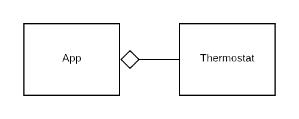

# Thermostat exercise

In this exercise we will apply the course materials from software engineering. The project will start simple and will continue to grow with features and refactorings. It is important to keep up with the extensions as they build further on the exercises that where previously made.

## Updating exercise instructions

Exercise instructions will be added as weeks pass. To get the latest instructions you need to pull them into your own project. This can be done with the following command:

```
git pull https://github.com/vives-softwareengineering-2019/thermostat.git master --allow-unrelated-histories
```

This will add or update the `exercise.md` file and its dependencies in your own project.

## Tagging releases

The exercise will continue to grow with extra features and changes. It is important to track the different states (or versions) of this project. For this we can make use of git **tags**.

At the end of every exercise you will need to _tag_ your version or commit. You can do this with the git tag command:

```
git tag v0.1
```

If for some reason you forgot to tag your version, and want to add an tag to a previous commit, you can simply add the commit hash at the end of the git tag command to tag that commit.

You can lookup previous commit by using git log:

```
git log --pretty=oneline
15027957951b64cf874c3557a0f3547bd83b3ff6 Merge branch 'experiment'
a6b4c97498bd301d84096da251c98a07c7723e65 beginning write support
0d52aaab4479697da7686c15f77a3d64d9165190 one more thing
6d52a271eda8725415634dd79daabbc4d9b6008e Merge branch 'experiment'
0b7434d86859cc7b8c3d5e1dddfed66ff742fcbc added a commit function
4682c3261057305bdd616e23b64b0857d832627b added a todo file
166ae0c4d3f420721acbb115cc33848dfcc2121a started write support
9fceb02d0ae598e95dc970b74767f19372d61af8 updated rakefile
964f16d36dfccde844893cac5b347e7b3d44abbc commit the todo
8a5cbc430f1a9c3d00faaeffd07798508422908a updated readme
```

and then tag th

```
git tag v0.2 9fceb02
```

All made tags can be listed using the git tag command.

```
git tag
```

Tags are created locally by default. When pushing commits to a remote you need to specifically tell git to push the tags. You can do this with the following command:

```
git push origin --tags
```

Always check on GitHub in your project that the tags are pushed correctly.

## Versions

### v0.1 Thermostat

The goal of this version is to create software solution that acts as a thermostat. Given that we have some temperatures, we would like to know what the result is. The result can be used to control a heating and airconditioning unit.

A thermostat can be set to a _wanted temperature_ value for a room. To prevent oscillations and improve efficiency we need to give a dead-zone or _range_ where the thermostat will neither put on the heating nor put on the airco. Next we need to be able to give the thermostat the _current temperature_ so that it can calculate the result.


Create a small Ruby application that demonstrates the functionality of an `Thermostat` class. The application could have the following class structure.



The application (for now) can define some hard-coded temperatures. For each of those temperatures, we will pass them to the `Thermostat` and display the results in the console.

The goal of the `App` is just to verify the `Thermostat` class, and that it is able to correctly control heating and airco units.